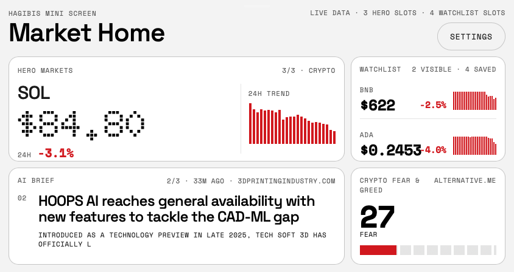

# Hagibis App Shell

A compact market-and-news dashboard built for the Hagibis 3.5-inch mini screen.

It ships as:

- a browser-based shell for fast iteration
- a native macOS wrapper that launches the local dashboard in a dedicated app window

## Screenshot



## What This Project Does

The dashboard is designed around a fixed `960x640` stage so the layout is tuned for the Hagibis display rather than for a generic laptop viewport.

The current interface is organized into four persistent zones:

- a rotating hero market panel
- a rotating watchlist panel
- an AI / market news brief panel
- a crypto Fear & Greed sentiment panel

## Current Feature Set

### Market layout

- `3` hero slots are stored and rotated through the main hero panel
- `4` watchlist slots are stored
- `2` watchlist rows are shown on screen at a time
- hero and watchlist items can be reordered from the settings panel
- removing a hero ticker automatically promotes a saved watchlist ticker when possible

### Settings panel

- assign a ticker to `Hero` or `Watchlist`
- move items up or down inside each bucket
- convert a watchlist item into a hero item
- move a hero item back to watchlist
- remove any saved ticker
- add a custom ticker symbol
- toggle automatic rotation on or off

### News brief

- rotates through up to `3` fetched articles between refreshes
- uses ticker-aware headlines when available
- clicking the brief opens the source article in the browser
- automatically shrinks headline/subline typography to fit the compact panel

### Sentiment panel

- shows the crypto Fear & Greed index value
- shows the sentiment classification
- renders a compact horizontal gauge for glanceability

### Native macOS shell

- packages the dashboard into `Hagibis Dashboard.app`
- launches a local Node server on an available loopback port
- displays the dashboard in a dedicated macOS window
- keeps the app isolated to `127.0.0.1`

## Data Providers

The server currently uses these providers:

- `CoinGecko` for crypto quotes and 24-hour mini-chart data
- `Finnhub` for stock quotes and candles when a key is configured
- `Yahoo Finance` as stock fallback in the server path
- `MarketAux` for ticker-aware headlines
- `The News API` as the secondary news source
- `Alternative.me` for crypto Fear & Greed

## Fallback Behavior

This repo is built to stay usable even when live providers are unavailable.

- if a news provider is not configured, the brief panel falls back gracefully
- if market data cannot be fetched, the UI falls back to safe placeholder values instead of crashing
- provider health is surfaced in the app state so the shell can distinguish between live, mixed, and fallback modes

## Environment Setup

Create `.env.local` in the repo root with:

```bash
MARKETAUX_API_TOKEN=your_marketaux_api_token
THE_NEWS_API_TOKEN=your_the_news_api_token
FINNHUB_API_KEY=your_finnhub_api_key
```

Notes:

- `CoinGecko` public crypto market data does not require a key
- `Alternative.me` does not require a key for the Fear & Greed endpoint
- `Finnhub` is only needed if you want live stock quotes

## Run The Browser Shell

```bash
./run-local.sh
```

What this script does:

- starts from port `4184`
- automatically finds the next open port if needed
- loads `.env.local` when present
- launches the dashboard in your default browser
- keeps the local server attached to the terminal

To force a different starting port:

```bash
./run-local.sh 4300
```

## Build And Run The Native App

Build the packaged macOS app:

```bash
./native-shell/package_test_build.sh
```

Open the packaged app:

```bash
./open-native-app.sh
```

Build and run through the helper script:

```bash
./script/build_and_run.sh
```

## Repo Layout

- [index.html](index.html) - shell markup
- [styles.css](styles.css) - compact stage styling
- [main.js](main.js) - client rendering, rotation, settings logic, and UI state
- [server.js](server.js) - provider adapters and JSON endpoints
- [native-shell/main.m](native-shell/main.m) - macOS AppKit/WebKit wrapper
- [native-shell/package_test_build.sh](native-shell/package_test_build.sh) - app bundling script
- [DATA_CONTRACT.md](DATA_CONTRACT.md) - current payload structure notes

## Notes

- This repo is optimized for the Hagibis mini-screen layout, not for fully responsive desktop breakpoints.
- The live data experience depends on third-party provider limits and availability.
- The screenshot above reflects one captured live state; prices, headlines, and sentiment will vary over time.
